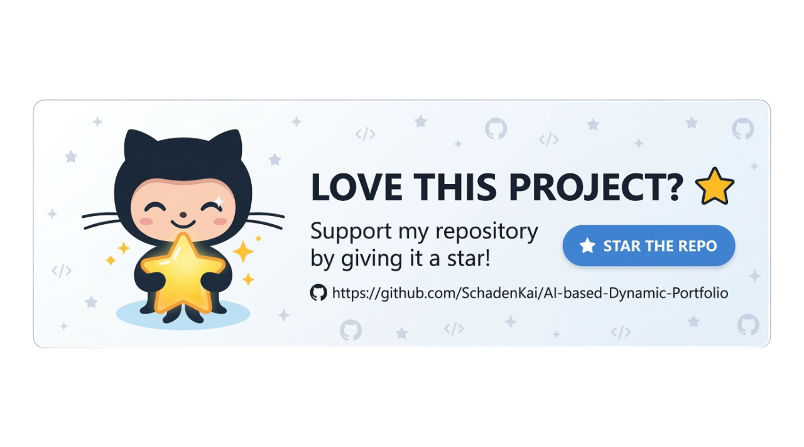

# AI-based Dynamic Portfolio



A modern, dynamic portfolio built with [Next.js](https://nextjs.org), designed to uniquely tailor content presentation using AI.

## Features

- **Dynamic Layout:** Uses Google Vertex AI (Gemini) to categorize and prioritize sections based on visitor interaction.
- **Data-Driven:** All content is powered by a central `profile.json` (similar to JSON Resume format).
- **SEO & Metadata Control:** All SEO configurations (Titles, Descriptions, Keywords, OpenGraph data) are centralized in a single configuration file.
- **Responsive & Accessible:** Built with modern CSS techniques for seamless experiences on all devices.
- **Dev.to Integration (Optional):** Fetches your latest posts from Dev.to automatically. If no API key is provided, the section gracefully degrades.

---

## 🚀 Installation & Setup

1. **Fork and clone the repository**
   Click the **Fork** button at the top right of this page to create your own copy on GitHub, then clone your fork:
   ```bash
   git clone https://github.com/YOUR_GITHUB_USERNAME/new-year-new-you-portfolio.git
   cd new-year-new-you-portfolio
   ```

2. **Install dependencies**
   ```bash
   npm install
   # or yarn / pnpm / bun install
   ```

3. **Set up Environment Variables (Optional)**
   The portfolio works perfectly fine as a static site without any environment variables. However, if you want to use the AI Chat or auto-fetch Dev.to posts, create a `.env.local` file in the root directory and add the following:
   ```env
   # Optional: For fetching dev.to articles
   DEV_TO_API_KEY=your_dev_to_api_key

   # Optional: For enabling the AI Chat Hero feature
   AI_PROVIDER=openai
   AI_API_KEY=your_openai_api_key
   ```
   *For details on the environment variables, see [Environment Variables Guide](./docs/env-vars.md).*

4. **Run the Development Server**
   ```bash
   npm run dev
   ```
   Open [http://localhost:3000](http://localhost:3000) with your browser to see the result.

---

## 📝 How to Update the Content (The Easy Way)

The content of this portfolio is entirely separated from the code, making it extremely easy to update without touching any React components.

All of your personal information (experience, projects, skills, education) lives in a single JSON file:
👉 **`src/data/profile.json`**

### Quick Steps:

1. Open `src/data/profile.json` in your editor.
2. Edit the text fields (e.g., `"name"`, `"summary"`, `"company"`, etc.) with your own information.
3. Save the file. The site will instantly reflect your new content!

For a more comprehensive, step-by-step tutorial on customizing the AI and advanced data updates, please read the **[Comprehensive Content Update Guide](./docs/content-update-guide.md)**.

---

## 🚀 How to Deploy and Update using Vercel

Vercel is the easiest way to deploy your Next.js portfolio.

### Initial Deployment

1. **Fork the Repository**: If you haven't already, click the **Fork** button at the top right of this page to create your own copy on GitHub.
2. **Sign up / Log in to Vercel**: Go to [vercel.com](https://vercel.com) and log in with your GitHub account.
3. **Add New Project**: From your Vercel dashboard, click **Add New** and select **Project**.
4. **Import Your Fork**: Find your newly forked `new-year-new-you-portfolio` repository in the list and click **Import**.
5. **Configure Project**:
   - Vercel will automatically detect that it's a **Next.js** project.
   - If you are using any environment variables (like `DEV_TO_API_KEY`, `AI_PROVIDER`, etc.), expand the **Environment Variables** section and add them here.
6. **Deploy**: Click the **Deploy** button. Wait a minute or two, and your site will be live!

### Updating Your Live App

Once deployed, updating your live portfolio is incredibly simple:

1. **Make Changes Locally**: Edit your `src/data/profile.json` or any other files.
2. **Commit Your Changes**:
   ```bash
   git add .
   git commit -m "Update portfolio content"
   ```
3. **Push to Your Fork**:
   ```bash
   git push origin main
   ```
4. **Automatic Deployment**: Vercel listens for changes to your main branch. As soon as you push to your fork, Vercel will automatically trigger a new deployment and update your live website within minutes. There is no need to manually deploy again!
